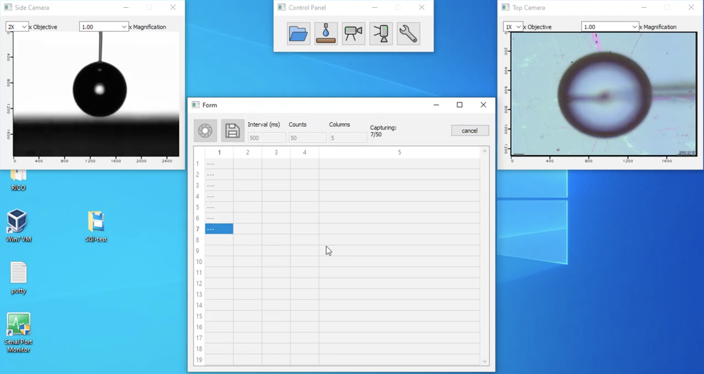
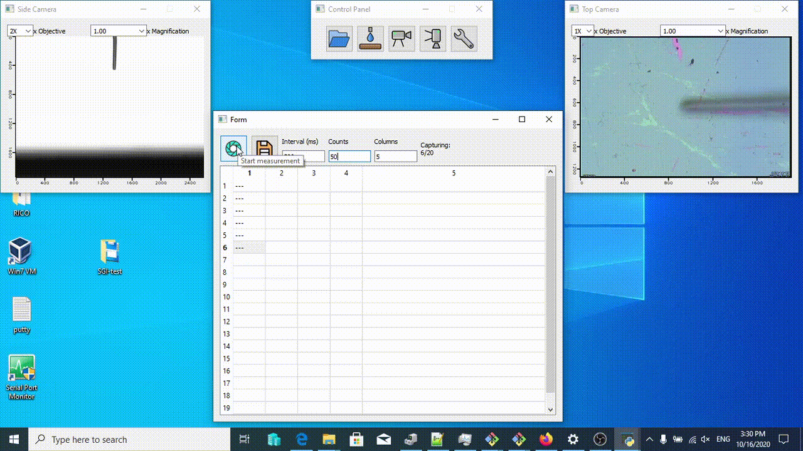
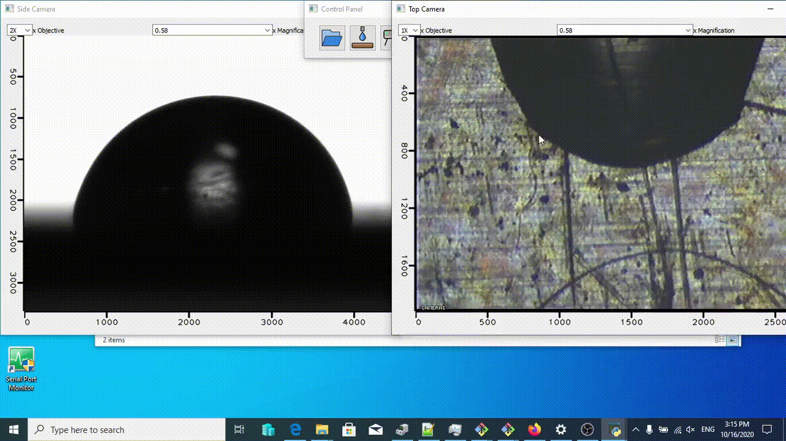
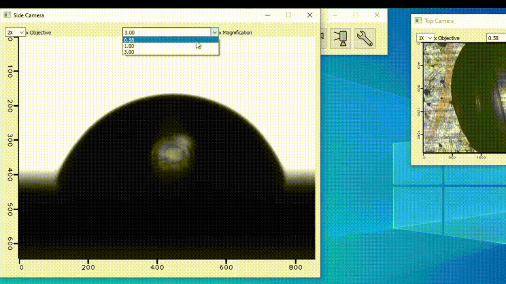

# Simple Goniometer Interface (`SGI`)

Simple Goniometer Interface (`SGI`) is a set of opensource software tools to be
used as the user interface to contact angle goniometers, including
dispensing control, image acquisition and data processing. The main components 
of `SGI` are written using `python` based on the `PyQt5` and `OpenCV` suits.

### Example GUI appearance 
The appearance of `SGI` on a particular machine (hardware: MCA-3, KYOWA, OS: Window) looks as image below, 
containing a main control panel, two video preview windows of side and top cameras, and a worksheet for data acquisition

### Compatible platform and hardware
The GUI part of `SGI` is platform-independent thanks to the `PyQt5` framework. It can in principle to be used as 
controling interface to a variety of commercial and home-made contact angle goniometers, with proper modification of 
certain modules. 

The current version of `SGI` is developed and tested on [MCA-3](http://face-kyowa.com/en/products/mca3/spec.html) 
from Kyowa Interfaces Science Solutions Co. Ltd. For `SGI` to work on other hardwares, the following points are required:
- **Video capturing device(s)**: have proper driver support on the desired OS, 
e.g. can be recognized by `DirectShow` on Windows or `video4linux2` on linux. 
`SGI` uses [`VideoCapture`](https://docs.opencv.org/3.4/d8/dfe/classcv_1_1VideoCapture.html) module from `OpenCV` to handle the video preview and capture.
- **Capture speed**: video devices are recommended to be connected to bus lanes with high bandwidth (e.g. USB3). 
The theoretical upper bound of framerate is limited by the underlying library of `OpenCV`
- **Dispenser control**: most commercial droplet dispensers can be communicated using USB, serial port or GPIO. 
`SGI` provides abstract interface to the actual hardware code which can be further customized. 

### Functionalities
- [x] Video preview and synchronization
- [x] Scale bar visualization during preview
- [x] Easy-to-modify camera configurations
- [x] Synchronized image acquision on multiple cameras
- [x] Dispenser control (hardware-dependent)
- [x] Tablar result viewer
- [x] Save and load result with formats compatible with commercial instruments (currently only FAMAS format)
- [ ] *TODO* Image post-processing
- [ ] *TODO* Droplet volume calculation

## The idea
**TODO** Provide a universal interface for Goniometer device that allows synchronized video / image capture.
### Setup
**TODO** Customized MCA-3
### Workflow
**TODO** *Draw the scheme of the interface*?

## Installation
### Control computer part
**TODO** 
- Python + Qt part
- Correctly setting the rc files?
### Camera side
**TODO** 
- On-computer camera?
- On-chip / RPi camera?
- ssh setup
- ssh call-up
#### Simple determination of video output 
1. Install the video4linux2 (v4l2) utilities, i.e. via `sudo apt-get install v4l2-utils`
2. Check which video device is recognized by running `v4l2-ctl --list-devices`
3. Figure out the channel number for the input e.g. composite using
   `v4l2-ctl -n -d /dev/video0`. 
4. Check if video capture is working using utilities like `qv4l2` or `yavta`

#### Installation on the Linux/RasPi/VM part
1. Enable the ssh server on Linux machine. `sudo apt-get update; sudo apt-get install openssh-server`. 
2. If the `sshd` service is down, strat it by `sudo service sshd start`
3. Make sure ssh into the VM is possible. Likely the bridged network is necessary.
4. Install the requirements: `sudo apt-get install git curl python3 python3-pip python3-venv motion`
5. Disable the default motion service 

## Usage
#### Video capture

#### Resizing video preview window

#### Change video preview scales

